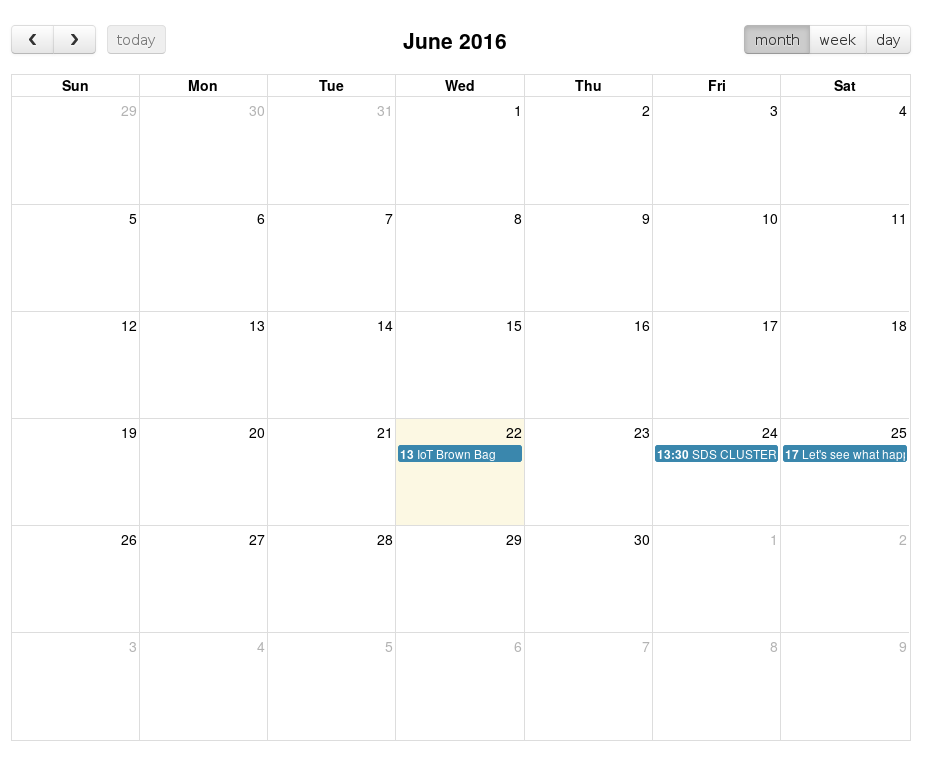

# Display CalDAV

A simple script to generate a read only HTML/JS/CSS calendar from icalendar files. The calendar is [FullCalendar](http://fullcalendar.io).

	pip install vobject jinja2

1) Use [vdirsyncer](https://vdirsyncer.readthedocs.io/en/stable) to sync CalDav files. 

	*/30 * * * * vdirsyncer sync > /dev/null

2) Generate HTML from the calendar files.
	
	*/30 * * * * python main.py > /dev/null

